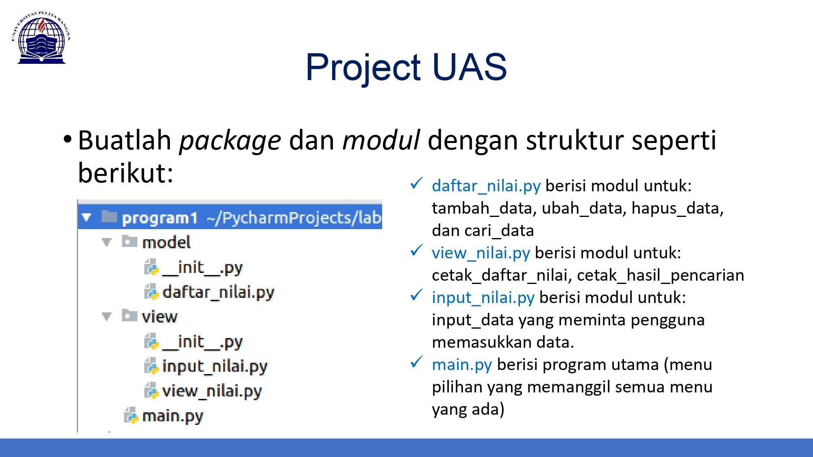

# <p align="center"> UAS Pemrograman
   ## <p align="center"> Galih Pangestu


<br>

link youtube : [This Link]()

  PDF : [Klik Disini](SS/Tutorial.pdf)


# Main.py
- Main.py berisi memanggil semua method dan modul-modul, simpelnya **Main.py** ini adalah tampilan utama yang berisi menu pilihan untuk memanggil semua method dan modul.
```bash
while True:
    print("-------------Menu pilihan-------------")
    print("1. Tambah Data \n2. Ubah Data \n3. Hapus Data \n4. Cetak Data \n5. Cari Data \n6. Keluar")
    print(" ")
    inputt = input('Pilih Menu 1-6 :  ')
    if inputt == '1':
        from view.input_nilai import input_data
        input_data()
    elif inputt == '2':
        from view.input_nilai import cari_ubah
        cari_ubah()
    elif inputt == '3':
        from view.input_nilai import hapuss
        hapuss()
    elif inputt == '4':
        from view.view_nilai import tampilkan
        tampilkan()
    elif inputt == '5':
        from view.input_nilai import cari_data
        cari_data()
    elif inputt == '6':
        print("Terima Kasih telah menggunakan Program ini!")
        break
    else:
        print("Masukan Menu Pilihan dengan benar!")
```

# Direktori Model | daftar_nilai.py
- Dalam pythonproject kita buat direktori yang diisi python file dengan nama **daftar_nilai,py**
- Fungsi dari **daftar_nilai.py** itu sendiri berisi modul dan penampung data (dictionary)
```bash
data = {}

def tambah_data(nama, nim, tugas, nilaiUTS, nilaiUAS, nilaiAkhir):
    data[nama] = nama, nim, tugas, nilaiUTS, nilaiUAS, nilaiAkhir

def hapus_data(nama):
    if nama in data.keys():
        del data[nama]
        print(f"Data {nama} berhasil Dihapus")
        kembali = input('Kembali Tekan [enter]')
        return True
    else:
        print(f'Data dengan Nama {nama} tidak ditemukan!')
        kembali = input('Kembali Tekan [enter]')
        return False

def ubah_data(nama):
    if nama in data.keys():
        del data[nama]
        from view.input_nilai import ubahh
        ubahh()
    else:
        print(f"Data dengan Nama {nama} tidak ada!")
        kembali = input('Kembali Tekan [enter]')
        return False

```

# Direktori view | view_nilai.py
- Setelah membuat direktori model yang berisikan **daftar_nilai.py** lalu membuat direktori yang berisi **view_nilai.py** dan **input-nilai.py**
- Fungsi dari **view_nilai** adalah untuk mencetak nilai serta mencetak hasil pencarian dari apa yang kita input di input_nilai.py
- Fungsi dari **input_nilai.py** adalah untuk tempat dimana pengguna menginputkan sesuatu, contohnya menginput menahbakan data, menginput data yang ingin dihapus, menginput data nama yang ingin dicari.

## view_nilai.py
```bash
from model.daftar_nilai import data
from tabulate import tabulate


def tampilkan():
    print(tabulate(data.values(),
                   headers=["Nama", "NIM", "TUGAS", "UTS", "UAS", "NILAI AKHIR"],
                   tablefmt="double_grid"))
    kembali = input('Kembali Tekan [enter]')


def cetak_hasil_pencarian(nama):
    datas = {}
    for key, value in data.items():
        if nama in value:
            datas[key] = value
            print(tabulate(datas.values(),
                           headers=["Nama", "NIM", "TUGAS", "UTS", "UAS", "NILAI AKHIR"],
                           tablefmt="double_grid"))
            kembali = input('Kembali Tekan [enter]')
            return True
        else:
            print("Data Tidak Ditemukan!")
            kembali = input('Kembali Tekan [enter]')
            return True
```
## input_nilai.py
```bash
from model.daftar_nilai import tambah_data, hapus_data, ubah_data

def input_data():
    while True:
        print(" ")
        print("===Input Data Mahasiswa===")
        nama = input('Nama Mahasiswa  : ')
        nim = int(input('NIM Mahasiswa   : '))
        tugas = int(input('Nilai Tugas     : '))
        nilaiUTS = int(input('Nilai UTS       : '))
        nilaiUAS = int(input('Nilai UAS       : '))
        nilaiAkhir = tugas * 30 / 100 + nilaiUTS * 35 / 100 + nilaiUAS * 35 / 100
        tambah_data(nama, nim, tugas, nilaiUTS, nilaiUAS, nilaiAkhir)
        tanya = input("Ingin tambah Data (y/n)?")
        if tanya.lower() == 'n':
            break

def hapuss():
    print(" ")
    print("Menu Hapus Data")
    hapus_data(input("Masukkan Data Yang Ingin Dihapus : "))

def cari_ubah():
    ubah_data(input("Masukkan Nama Yang Ingin Di ubah : "))

def ubahh():
    print(" ")
    print("===Masukkan Data Baru===")
    nama = input('Nama Mahasiswa  : ')
    nim = int(input('NIM Mahasiswa   : '))
    tugas = int(input('Nilai Tugas     : '))
    nilaiUTS = int(input('Nilai UTS       : '))
    nilaiUAS = int(input('Nilai UAS       : '))
    nilaiAkhir = tugas * 30 / 100 + nilaiUTS * 35 / 100 + nilaiUAS * 35 / 100
    tambah_data(nama, nim, tugas, nilaiUTS, nilaiUAS, nilaiAkhir)
    print("Data Berhasil diubah")
    kembali = input('Kembali Tekan [enter]')

def cari_data():
    from view.view_nilai import cetak_hasil_pencarian
    cetak_hasil_pencarian(input("Masukkan Nama yang ingin dicari : "))
```

# <p align="center"> Hasil Run Program
# Modul Tambah Data

# Modul Hapus Data

# Modul Ubah Data

# Modul Cari Data

# Modul untuk Mencetak Data
